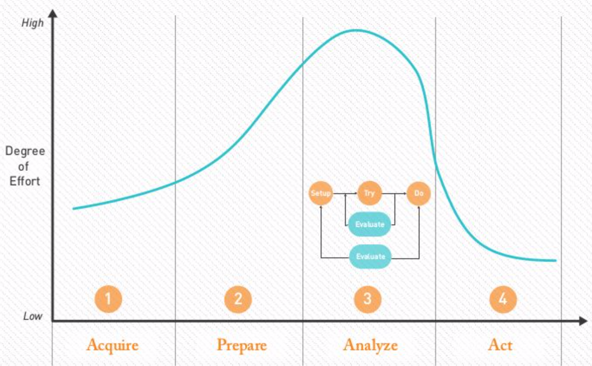
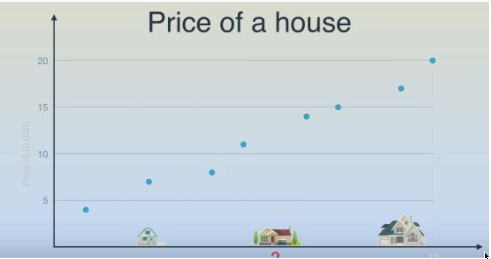
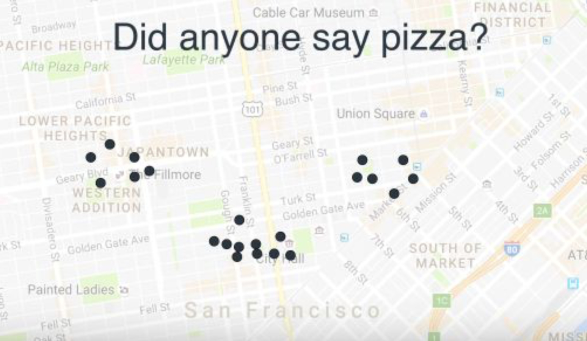

# Introduction to Data Science Course

     

## About me
### Anuj Garg (@KeenWarrior)

- Open Source Enthusiast.
- GSoC mentor and admin with JBoss Community.
- GCI mentor and admin with JBoss Community.
- Working as Data Science Expert with RedHat.
- Love to work on Genetic Algorithms and Compliant Mechanisms.
- Research Papers on Fraud Detection and Avoidance.

     

## Student Presentations (5-10 volunteers)

1. Name
2. Educational background
3. Professional background
4. Current knowledge of AI / ML / DS

     

## Discuss
- Machine Intelligence
- AI vs ML vs DL vs DS

     

## The Data Science Lifecycle

1. Collect Data - **Acquire**
2. Understand the structure of the data - **Prepare**
    + Statistical Reasoning 
    + Patience.
3. Build Predictive Models around the Data - **Analyse**
    + Iterative Process
    + Setup - Try - Do
    + Good Bit: Error Minimization Framework = f(Experience)
4. Put them into practice - **Act**
    + Let the business people take over
    

## Basic concept of working with Data

     

## Building Algorithms
1. Price of a house
2. Optimize Location of 3 pizza parlours

## Price of a house

### Food for thought
1. Add another variable :- Repute of the Locality
2. Add another variable :- Lease/ Freehold 3. And another :p :- Year of Construction

### Talk of : -
1. Problem Dimensionality
2. Nature of Curve to fit

## Optimize Location of 3 pizza parlours

### Food for thought
1. Add another variable - height from sea.

### Talk of : -
1. Dimensionality

## Buzz Words
- Supervised Learning, Unsupervised Learning, Reinforcement Learning
- Classification / Regression
- Features
- Training Data
- Validation Data
- Overfitting, Underfitting
- Weights
 

## Where Does Data Come From?

- Your Own Website
- Public Data Sets
- IOT/Sensors
- Other Websites

## Why Now? (Driving Factors)
- Lots of Data
- Ability to process it

## Statistics
- Every minute up to **300 hours of video** are uploaded to YouTube.
- Average of **31.25 million messages** and view 2.77 million videos every minute on Facebook.
- More data has been created in the past two years than in the entire previous history of the human race.
- At the moment **less than 0.5%** of all data is ever analyzed and used, just imagine the potential here.

## Common Data Science Projects

1. Fraud and anomaly detection
2. Predicting customer value
3. A/B testing
4. Recommendation engines
5. Customer Support automatization
6. Data Integration & Collection

 

